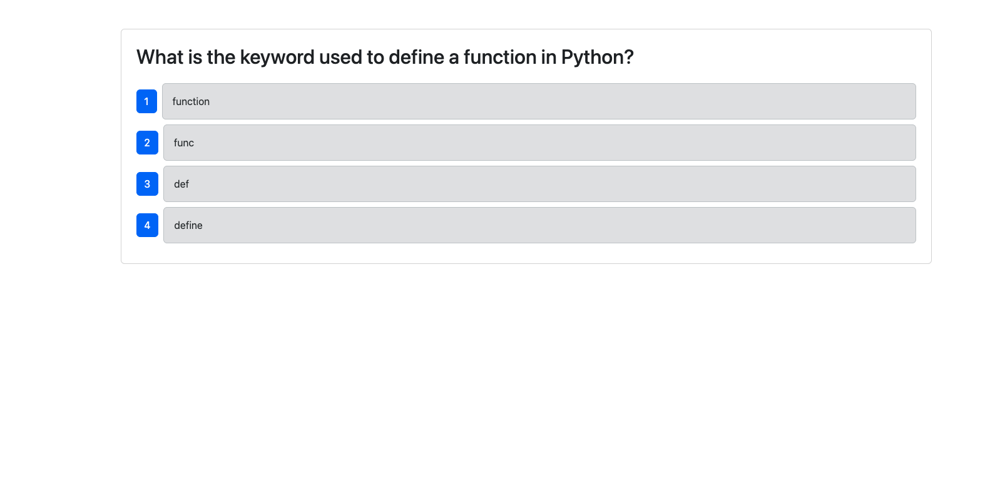

# CypressTesting

## Description:

I enhanced a fully functioning Tech Quiz application by integrating Cypress for both component and end-to-end testing. The Tech Quiz app, built using the MERN stack (MongoDB, Express.js, React, and Node.js), allows users to take a quiz consisting of ten Python-related questions and view their final score. This testing process strengthens the app's reliability and ensures its core features function as expected.

## Table of Contents:

- [Installation](#installation)
- [Usage](#usage)
- [License](#license)
- [Contributing](#contributing)
- [Tests](#tests)
- [Questions](#questions)

## Installation:

You can clone this repository onto your local computer. Run the command "npm install" to install all modules. Run "npm run build" to compile the TypeScript into JavaScript. Use "npm run seed" to ensure you connect to the database. Start the application with "npm run start:dev".

Open a second terminal and enter "npm run test" to execute the tests.

** Make sure you are running the application locally before running your test!**

## Usage:
To use the application, click on the Start Quiz button, and select one of the four multiple choice questions.

To run the tests, refer to the Installation steps in the section above.

[Click here to view my video demo!](https://drive.google.com/file/d/1-MnQFCnE9YlxacHNmUfFGmq9EiWX6qYe/view?usp=sharing)

## License:

[Click to read more!](https://opensource.org/licenses/MIT)

## Contributing:

- Create a feature branch using "git checkout -b _branchname_" in your terminal.
- After making your changes, type in the command "git commit -m "_detailed message on added features_".
- Push changes to your feature branch using "git push origin _branchname_".
- Finally, create a pull request on Github for those changes to be merged.

Contributions are appreciated😊!

## Tests:

N/A

## Questions:

- Github: [Link to profile](https://github.com/victoriamata)
- Email: victoriamataxo@gmail.com